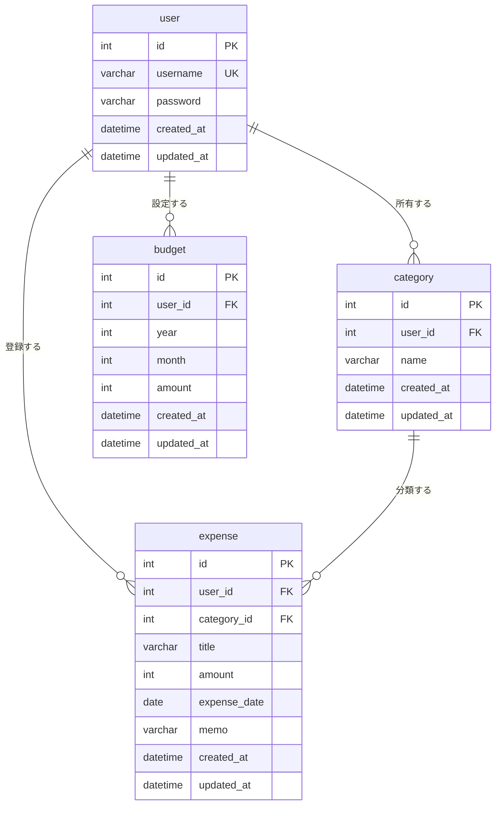

# 家計簿アプリ

ユーザーのお金の使い過ぎを防止するために目標設定と使用料金の差額の可視化およびどのように使いすぎを防止するのかを考えたアプリ

## 技術構成

| 区分 | 使用技術 |
| --- | --- |
| サーバーサイド | PHP 8.1 / FuelPHP 1.9 |
| データベース | MySQL 8.0（`DB` クラス経由でアクセス） |
| フロントエンド | knockout.js / fetch による非同期通信 |
| 状態管理 | Session（ログイン状態）/ Cookie（表示テーマ） |

## 動作環境

- PHP 8.1 以上（`mbstring` `pdo_mysql` `curl` `xml` `zip`）
- MySQL 8.0
- Composer 2.x

## セットアップ

### 1. 依存パッケージの取得

```bash
composer install
```

`fuel/core` や `fuel/packages/*` はリポジトリに含めていないため、clone 後は必ず実行する。

### 2. データベースの作成（初回のみ）

すでに `kakeibo` データベースを作成済みの場合はこの手順は不要。

`sudo mysql`でmysqlに接続

```sql
CREATE DATABASE IF NOT EXISTS kakeibo CHARACTER SET utf8mb4 COLLATE utf8mb4_unicode_ci;
CREATE USER IF NOT EXISTS 'kakeibo'@'localhost' IDENTIFIED BY '12345678';
CREATE USER IF NOT EXISTS 'kakeibo'@'127.0.0.1' IDENTIFIED BY '12345678';
GRANT ALL PRIVILEGES ON kakeibo.* TO 'kakeibo'@'localhost';
GRANT ALL PRIVILEGES ON kakeibo.* TO 'kakeibo'@'127.0.0.1';
FLUSH PRIVILEGES;
```

パスワードは `db.php.example` と同じ `12345678` に固定している（開発用ローカルDBのみで使う値のため）。変えたい場合は、このSQLと `fuel/app/config/development/db.php` の両方を同じ値に揃えること。

環境によっては、PHPの `pdo_mysql` が `localhost` をUnixソケットではなくTCP（`127.0.0.1`）経由で接続することがある。`mysql -u kakeibo -p` ではログインできるのにアプリからは `Access denied` になる場合は、`'kakeibo'@'127.0.0.1'` のユーザー・権限が無いことが原因のことが多いため、両方作成しておく。

**`Access denied` が出た場合の注意点：** `CREATE USER IF NOT EXISTS` は、そのユーザーが既に別のパスワードで存在していると**何もせずスキップする**（パスワードは更新されない）。以前に一度でもこのSQLを別のパスワードで実行したことがある場合、`db.php` の値と実際のMySQL側のパスワードがズレて `Access denied` になる。その場合は以下でパスワードを強制的に上書きする。

```sql
ALTER USER 'kakeibo'@'localhost' IDENTIFIED BY '12345678';
ALTER USER 'kakeibo'@'127.0.0.1' IDENTIFIED BY '12345678';
FLUSH PRIVILEGES;
```

### 3. 接続設定

```bash
cp fuel/app/config/development/db.php.example fuel/app/config/development/db.php
```

コピーした `db.php` の `username` と `password` を自分の環境の値に書き換える。このファイルは接続情報を含むため `.gitignore` の対象で、リポジトリには入らない。

### 4. 書き込み権限の付与

```bash
chmod -R 777 fuel/app/logs fuel/app/cache fuel/app/tmp
```

### 5. 起動

```bash
php -S localhost:8080 -t public
```

`http://localhost:8080` を開く。公開するのは `public/` のみで、`fuel/` 以下は外部に露出させない。

WSL2 では MySQL が自動起動しないため、起動前に以下が必要。

```bash
sudo service mysql start
```

### 6. 本番相当での起動（任意）

`FUEL_ENV` を指定すると、PHPのエラー詳細を画面に表示しないモードで起動できる。

```bash
FUEL_ENV=production php -S localhost:8080 -t public
```

未指定時は `development` として動作し、従来通りエラー詳細が表示される（開発時はこちらを使う）。

## ディレクトリ構成

```
fuel/app/          アプリ本体（classes / config / views / migrations）
fuel/core/         フレームワーク本体（composer 管理・非コミット）
fuel/packages/     追加パッケージ（composer 管理・非コミット）
public/            公開ディレクトリ。ここだけが Web から見える
oil                CLI ツール（マイグレーション等）
```

## 設定ファイル

| ファイル | 内容 | コミット |
| --- | --- | --- |
| `fuel/app/config/config.php` | ロケール（ja_JP）、タイムゾーン（Asia/Tokyo） | する |
| `fuel/app/config/development/db.php` | DB 接続情報 | **しない** |
| `fuel/app/config/development/db.php.example` | 接続情報のひな形 | する |
| `fuel/app/config/crypt.php` | 初回起動時に自動生成される暗号化キー | **しない** |

### アプリ独自の設定（kakeibo.php）

`fuel/app/config/kakeibo.php` に、このアプリ固有の設定値をまとめている。`\Config::get('kakeibo.キー名')` で参照する。

| キー | 内容 | 初期値 |
| --- | --- | --- |
| `quick_amounts` | 支出登録フォームのクイック金額ボタン | `[100, 500, 1000, 5000, 10000]` |
| `max_expense_amount` | 支出1件あたりの金額の上限 | `1000000` |
| `budget_alert_threshold` | 支出上限に対する使用率がこの値(%)を超えたら警告表示 | `80` |
| `list_per_page` | 支出一覧の表示件数（10/50/100から選択） | `10` |
| `default_category` | 新規登録時に自動作成される初期カテゴリ | `食費` `交通費` `娯楽費` `日用品` `その他` |
| `default_theme` | Cookie未設定時の表示テーマ | `light` |
| `theme_cookie_name` | テーマを保存するCookie名 | `kakeibo_theme` |
| `theme_cookie_expiry` | テーマCookieの保持期間（秒） | `31536000`（1年） |

## データベース設計



`user` が起点の1:n関係（1人のユーザーが複数のカテゴリ・支出・目標を持つ）と、`category`→`expense` の1:n関係（1つのカテゴリに複数の支出が紐づく）で構成する。カテゴリ名を `expense` に直接持たせず `category_id` で参照することで、カテゴリ名を変更したときに支出データ側を書き換える必要がない（正規化）。

## 画面一覧

ログイン中は画面左のサイドバーから各画面に移動できる。トップページ（`/`）はホーム画面にリダイレクトされる。

| 画面 | URL | 認証 | 機能 |
| --- | --- | --- | --- |
| ログイン | `/login` | 不要 | ログイン・ログアウト |
| 新規登録 | `/register` | 不要 | アカウント作成、初期カテゴリ自動作成 |
| ホーム | `/home`（トップページ） | 必要 | 今月の支出合計・上限比較・使用率・警告表示、月ごとの支出推移（棒グラフ） |
| 支出一覧 | `/expense` | 必要 | 一覧・削除（非同期）、月/カテゴリ絞り込み、ソート、件数切替、カテゴリ別集計 |
| 支出の新規登録 | `/expense/new` | 必要 | 新規登録、金額クイックボタン |
| カテゴリ管理 | `/category` | 必要 | 一覧・新規登録・編集・削除 |
| 支出目標 | `/budget` | 必要 | 月ごとの上限設定・変更 |
| 設定 | `/settings` | 必要 | テーマ切替、退会への導線 |
| アカウント削除 | `/account` | 必要 | 退会（確認後、関連データを一括削除） |

## コードの置き場所

| 種類 | 置き場所 | 命名規則 |
| --- | --- | --- |
| Controller | `fuel/app/classes/controller/` | `Controller_◯◯`（プレフィックス方式） |
| Model（DBの1テーブルに対応） | `fuel/app/classes/model/` | `Model_◯◯` |
| Service（業務ロジック） | `fuel/app/classes/service/` | `namespace Service;` |
| Repository（DB問い合わせ） | `fuel/app/classes/repository/` | `namespace Repository;` |
| View | `fuel/app/views/◯◯/` | コントローラ名のディレクトリに揃える |

Controller・Model は FuelPHP標準のプレフィックス方式、Service・Repository は独自の名前空間（`fuel/app/bootstrap.php` で登録）を使う。DBへのアクセスは `\DB` クラス経由に統一し、Controller から直接呼ばない。

## ブランチ運用

`feature/*` → `develop` → `main` の順に PR ベースでマージする。機能単位でブランチを切り、単体で動作する状態にしてから PR を出す。
